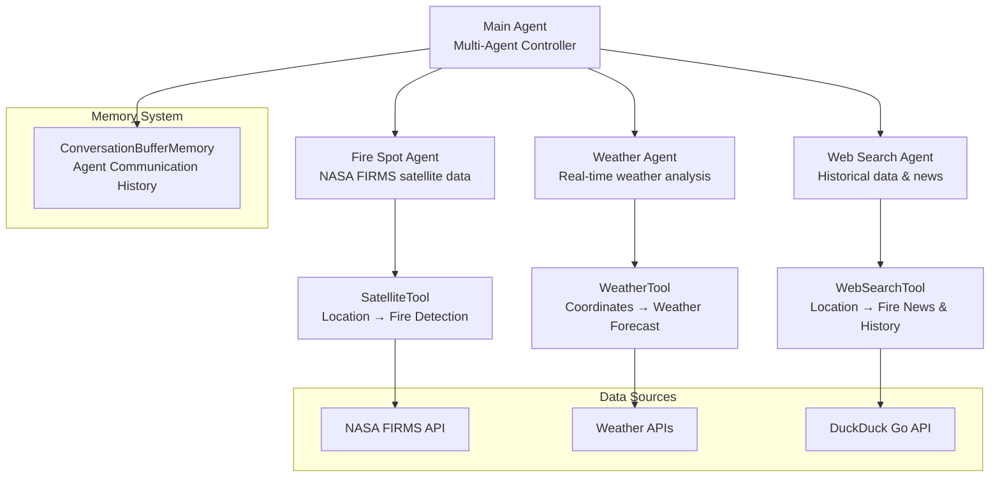

# PyroScan AI - Multi-Agent AI System for Forest Fire Prediction & Monitoring

PyroScan AI is an advanced **multi-agent artificial intelligence system** designed to predict, monitor, and analyze forest fires using real-time satellite data from NASA FIRMS API, weather information, and historical fire data. The system employs a sophisticated agentic architecture with specialized AI agents working collaboratively to provide comprehensive fire risk assessment and early warning capabilities for critical forest regions worldwide.

## Key Features

- **Multi-Agent System**: Coordinated AI agents working together for comprehensive analysis
- **Real-time Fire Detection**: Live fire data from NASA FIRMS satellite API
- **Multi-Region Monitoring**: Tracks fire incidents in 10 critical forest regions globally
- **Weather Integration**: Real-time weather data analysis for fire risk assessment
- **Historical Analysis**: Web search capabilities for historical fire data and news
- **Intelligent Filtering**: AI-powered filtering based on proximity to high-risk areas
- **Agentic Decision Making**: Advanced AI analysis and prediction capabilities
- **Geographic Analysis**: Location-based fire risk assessment and mapping

## Target Monitoring Regions

The system monitors fire incidents in these critical forest regions:

- **Amazon Rainforest** (Brazil)
- **California Wildlands** (USA)
- **British Columbia** (Canada)
- **Siberia Forests** (Russia)
- **Athens Outskirts** (Greece)
- **Canberra Region** (Australia)
- **Alberta Forests** (Canada)
- **Western Cape** (South Africa)
- **Mato Grosso** (Brazil)
- **Los Angeles National Forest** (USA)

## Multi-Agent System Architecture

PyroScan AI employs a sophisticated multi-agent architecture where specialized AI agents collaborate to provide comprehensive fire analysis:



## Agent System Overview

### Main Agent (Controller)

The **Main Agent** serves as the central coordinator of the multi-agent system, orchestrating communication between specialized agents and managing the overall fire analysis workflow.

**Capabilities:**

- Coordinates all other agents
- Manages conversation memory
- Integrates results from multiple agents
- Provides comprehensive fire risk assessment
- Makes final recommendations based on agent inputs

### Fire Spot Agent

The **Fire Spot Agent** specializes in real-time fire detection and analysis using NASA FIRMS satellite data.

**Capabilities:**

- Fetches live fire data from NASA FIRMS API
- Analyzes fire activity patterns
- Identifies active fire hotspots
- Provides fire intensity and spread analysis
- Filters fire data for monitored regions

**Tools:**

- `Fire data tool`: Retrieves recent fire data from NASA FIRMS API for given coordinates

### Weather Agent

The **Weather Agent** focuses on weather analysis and its impact on fire risk assessment.

**Capabilities:**

- Retrieves current weather conditions
- Analyzes weather forecasts
- Assesses weather-related fire risk factors
- Monitors temperature, humidity, and wind conditions

**Tools:**

- `Weather data tool`: Retrieves current or forecasted weather data for given coordinates

### Web Search Agent

The **Web Search Agent** gathers historical fire data and recent news about fire incidents.

**Capabilities:**

- Performs live web searches for fire-related information
- Gathers historical fire data for specific locations
- Analyzes recent fire news and reports
- Provides context about previous fire incidents
- Identifies patterns in fire occurrence

**Tools:**

- `Web search tool`: Performs live web searches for location-specific fire information

## Installation

### Prerequisites

- Python 3.8 or higher
- pip package manager

### Setup Instructions

1. **Clone the repository**

   ```bash
   git clone https://github.com/sjsreehari/PyroScan-AI.git
   cd PyroScan-AI
   ```

2. **Create a virtual environment (recommended)**

   ```bash
   python -m venv venv

   # On Windows
   venv\Scripts\activate

   # On macOS/Linux
   source venv/bin/activate
   ```

3. **Install dependencies**
   ```bash
   pip install -r requirements.txt
   ```

## API Keys Setup

PyroScan AI requires API keys for external services. Create a `.env` file in the project root with the following keys:

### Required API Keys

1. **NASA FIRMS API Key**

   - Get your API key from: https://firms.modaps.eosdis.nasa.gov/api/
   - Add to `.env` file:

   ```
   NASA_FIRM_API_KEY=your_nasa_api_key_here
   ```

2. **OpenRouter API Key**
   - Get your API key from: https://openrouter.ai/settings/keys
   - Add to `.env` file:
   ```
   OPENROUTER_API_KEY=your_openrouter_api_key_here
   ```
3. **Weather API Key**
   - Get your API key from: https://www.weatherapi.com/my/
   - Add to `.env` file:
   ```
   WEATHERAPI_API_KEY=your_weather_api_key_here
   ```

### Example `.env` file:

```
NASA_FIRM_API_KEY=9b****************04c6ee
OPENROUTER_API_KEY=your_openrouter_api_key_here
WEATHERAPI_API_KEY=your_weather_api_key_here
```

## Project Structure

```
PyroScan-AI/
├─ .dockerignore
├─ Dockerfile
├─ main.py                          # Main application entry point
├─ pyroscan-ai.toml                 # Configuration file
├─ README.md
├─ requirements.txt                 # Python dependencies
├─ run.sh                          # Shell script for running
├─ src/
│  ├─ agent/                       # Multi-agent system components
│  │  ├─ fire_spot_agent.py        # Fire detection agent
│  │  ├─ main_agent.py             # Main controller agent
│  │  ├─ prompt.py                 # Agent prompts and instructions
│  │  ├─ weather_agent.py          # Weather analysis agent
│  │  └─ web_search_agent.py       # Web search agent
│  ├─ data/
│  │  └─ danger-zone.csv           # High-risk zone data
│  ├─ server/
│  │  └─ app.py                    # Web server application
│  ├─ tools/                       # Agent tools and utilities
│  │  ├─ fire_data.py              # Fire data processing
│  │  ├─ runnable.py               # Runnable tool implementations
│  │  ├─ weather_data.py           # Weather data processing
│  │  └─ web_search.py             # Web search functionality
│  └─ utils/                       # Utility functions
│     ├─ get_cordinates.py         # Coordinate utilities
│     └─ unique_id.py              # ID generation utilities
└─ workflow.mmd                    # Workflow documentation
```

## Usage

### Running Individual Agents

#### Fire Data Tool

```bash
python src/tools/fire_data.py
```

This will:

- Fetch real-time fire data from NASA FIRMS API
- Filter data for monitored regions
- Save filtered data to `src/db/filtered_fire_data.csv`

#### Main Multi-Agent Application

```bash
python main.py
```

### Running with Docker

```bash
# Build the Docker image
docker build -t pyroscan-ai .

# Run the container
docker run -p 8483:8483 --env-file .env pyroscan-ai
```

# <<<<<<< HEAD

> > > > > > > 82af3dc432d1890668abc075d36ca461d3aa20b7

## Data Sources

- **NASA FIRMS API**: Real-time satellite fire detection data
- **Weather APIs**: Current and forecasted weather conditions
- **Web Search APIs**: Historical fire data and news
- **VIIRS Satellite**: Visible Infrared Imaging Radiometer Suite
- **NRT Data**: Near Real-Time fire detection

## AI Components

- **Multi-Agent System**: Coordinated AI agents for comprehensive analysis
- **Decision Maker**: AI agent for fire risk assessment
- **Heat Map Classifier**: Machine learning for fire pattern analysis
- **Prompt Engineering**: Optimized prompts for AI analysis
- **Memory Management**: Conversation buffer for agent communication

## Safety Features

- **Real-time monitoring** of critical forest regions
- **Geographic proximity analysis**
- **Risk assessment algorithms**
- **Multi-region coverage** for global monitoring

## Technical Specifications

- **Framework**: LangChain for agent orchestration
- **AI Models**: DeepSeek Chat v3 via OpenRouter
- **Memory**: ConversationBufferMemory for agent communication
- **Tools**: Custom tools for fire data, weather, and web search
- **Architecture**: Multi-agent system with specialized agents

## Disclaimer

PyroScan AI is designed for research and monitoring purposes. Always follow local emergency protocols and contact appropriate authorities in case of actual fire emergencies. The system provides analysis and predictions but should not be the sole source for emergency decisions.

<h2 align="center">⭐ Drop a star on GitHub if you find PyroScan AI useful!</h2>
